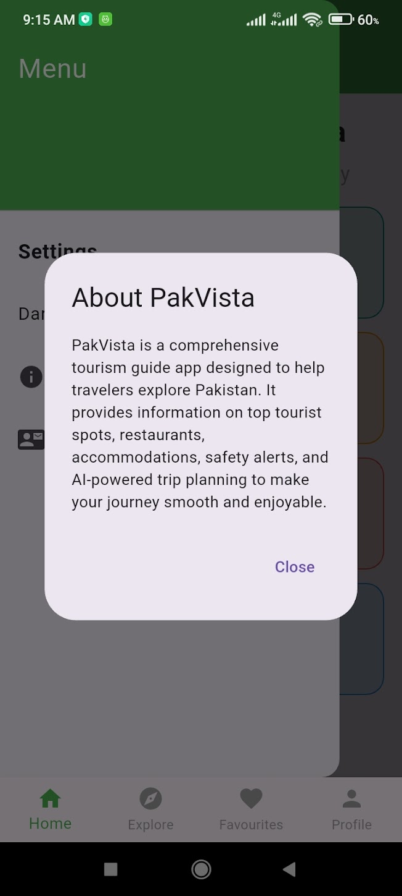
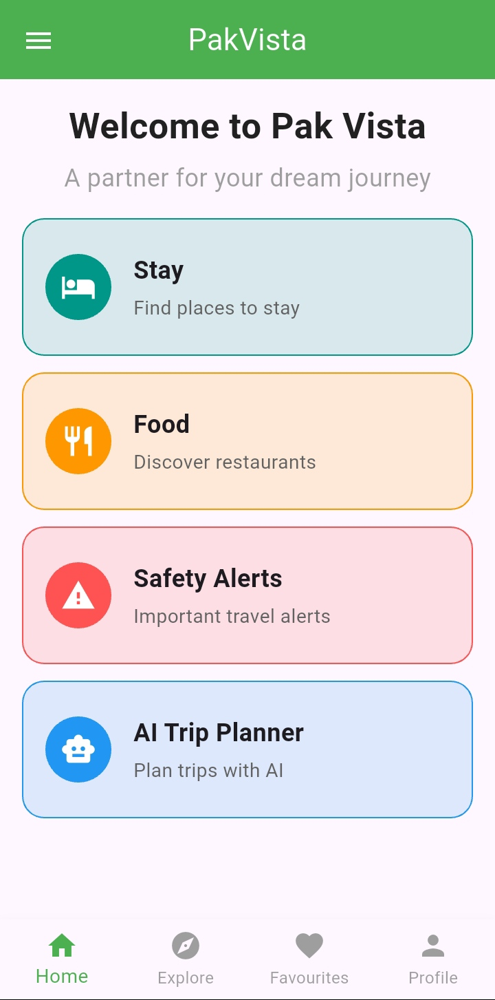
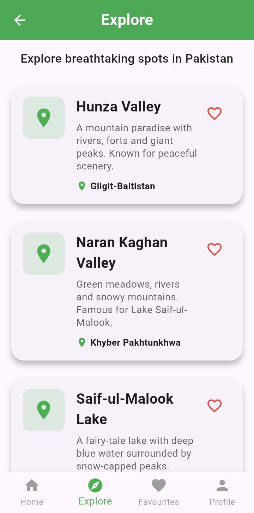
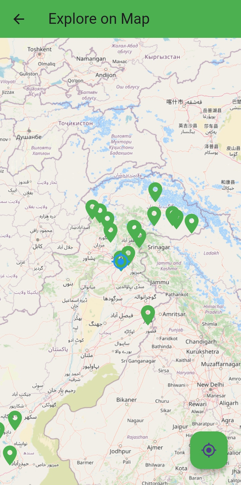
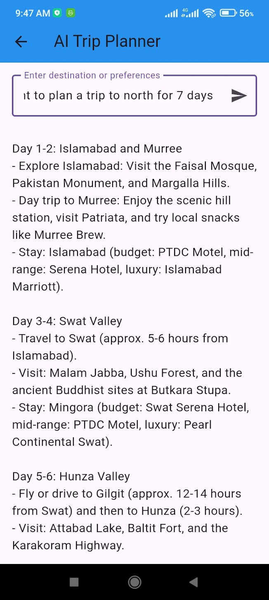
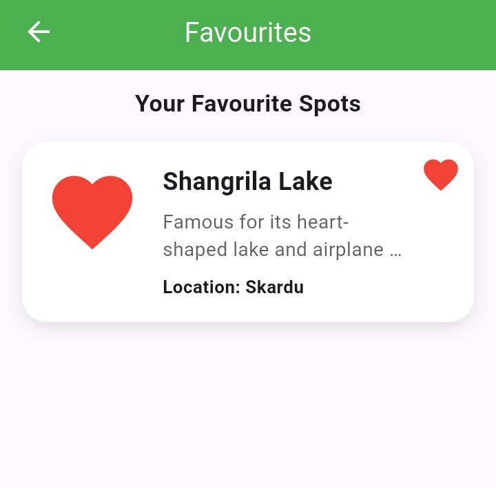
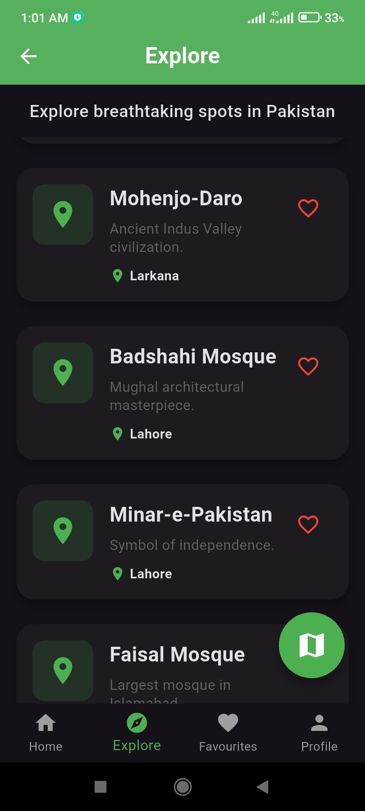

# PakVista 🇵🇰

### Explore Pakistan. Discover Experiences. Plan Smarter.

**PakVista** is a Flutter-based tourism and travel guide application designed to provide users with a modern digital platform for discovering Pakistan's tourist destinations, exploring locations through interactive maps, discovering food and accommodation options, saving favourite destinations, and planning trips with the help of AI.

---

## 📱 Project Overview

Pakistan is home to diverse landscapes, historical landmarks, cultural heritage, and unique travel experiences. PakVista aims to bring these experiences together in a single, user-friendly mobile application.

The application combines **Flutter development, interactive maps, location services, tourism information, and AI-powered trip planning** to provide travelers with a more convenient way to explore Pakistan.

---

## ✨ Key Features

### 🏠 Home

A dedicated home screen providing users with an overview of PakVista and quick access to important tourism features.

### 🗺️ Explore

Discover tourist destinations and explore different places across Pakistan through an organized and visually appealing interface.

### 📍 Interactive Map

Explore tourist destinations geographically using an interactive map interface with location-based functionality.

### 🤖 AI Trip Planner

Generate personalized travel plans using AI. Users can provide their travel requirements and preferences to receive an AI-generated itinerary.

### ❤️ Favourites

Save interesting destinations and quickly access them later.

### 🍽️ Food & Dining

Explore information and recommendations related to Pakistani food and dining experiences.

### 🏨 Places to Stay

Discover accommodation-related information to help users plan their trips.

### 🛡️ Safety Information

Access safety-related information and travel alerts to help users travel more responsibly.

### 👤 User Profile

A dedicated profile section for managing and viewing user-related information.

### 🎨 Modern UI

A tourism-focused interface designed with Flutter, featuring custom screens, cards, navigation, imagery, and a consistent visual theme.

---

# 📸 Application Screenshots

## About PakVista



## Home Screen



## Explore Screen



## Interactive Map



## AI Trip Planner



## Favourites



## Contact


## Application Theme



---

# 🛠️ Technologies Used

| Technology         | Purpose                                       |
| ------------------ | --------------------------------------------- |
| **Flutter**        | Cross-platform mobile application development |
| **Dart**           | Application programming language              |
| **OpenRouter API** | AI-powered trip planning                      |
| **Flutter Map**    | Interactive maps                              |
| **Geolocator**     | Location services                             |
| **HTTP**           | API communication                             |
| **Android Studio** | Android development                           |
| **VS Code**        | Development environment                       |
| **Git**            | Version control                               |
| **GitHub**         | Source code management                        |

---

# 🏗️ Project Structure

```text
pakvista/
│
├── android/
├── ios/
├── linux/
├── macos/
├── web/
├── windows/
│
├── lib/
│   ├── main.dart
│   ├── detail_screen.dart
│   │
│   ├── screens/
│   │   ├── ai_trip_planner_card.dart
│   │   ├── explore_screen.dart
│   │   ├── favourites_screen.dart
│   │   ├── food_card.dart
│   │   ├── home_screen.dart
│   │   ├── login_screen.dart
│   │   ├── map_screen.dart
│   │   ├── profile_screen.dart
│   │   ├── safety_alerts_card.dart
│   │   ├── splash_screen.dart
│   │   ├── stay_card.dart
│   │   ├── tourist_spot.dart
│   │   └── tourist_spots_data.dart
│   │
│   └── services/
│       └── ai_trip_planner_service.dart
│
├── screenshots/
│   ├── pakvista.about.jpg
│   ├── pakvista.AI.jpg
│   ├── pakvista.contact.jpg
│   ├── pakvista.explore.jpg
│   ├── pakvista.favourites.jpg
│   ├── pakvista.home.jpg
│   ├── pakvista.map.jpg
│   └── pakvista.theme.jpg
│
├── test/
├── .gitignore
├── README.md
├── pubspec.yaml
└── pubspec.lock
```

---

# 🤖 AI Trip Planner

One of the major features of PakVista is its **AI Trip Planner**.

The application communicates with an AI model through the **OpenRouter API** to generate personalized travel plans based on user requirements.

The AI functionality can help users organize their travel plans and discover suitable destinations and activities.

For security, API credentials are **not stored directly in the source code or GitHub repository**.

The application reads the API key through a build-time environment variable:

```dart
String.fromEnvironment('OPENROUTER_API_KEY')
```

To run the application locally with your own API key:

```bash
flutter run --dart-define=OPENROUTER_API_KEY="YOUR_API_KEY"
```

**Never commit an API key to GitHub.**

---

# 🚀 Getting Started

## Prerequisites

Install the following before running PakVista:

* Flutter SDK
* Dart SDK
* Android Studio or VS Code
* Android device or emulator
* Git

Check your Flutter installation:

```bash
flutter doctor
```

---

## Installation

Clone the repository:

```bash
git clone https://github.com/umarmoazzam05-cmd/pakvista.git
```

Navigate to the project directory:

```bash
cd pakvista
```

Install Flutter dependencies:

```bash
flutter pub get
```

Run the application:

```bash
flutter run
```

For AI Trip Planner functionality:

```bash
flutter run --dart-define=OPENROUTER_API_KEY="YOUR_API_KEY"
```

---

# 🎯 Project Objectives

PakVista was developed with the following objectives:

* Promote tourism in Pakistan
* Make tourism information easier to access
* Help users discover tourist destinations
* Provide interactive location-based exploration
* Simplify travel planning
* Introduce AI-powered trip planning
* Provide a modern digital tourism experience
* Encourage exploration of Pakistan's cultural and natural attractions

---

# 🔮 Future Improvements

Future versions of PakVista may include:

* Real-time weather information
* Hotel and restaurant integrations
* Advanced AI itinerary generation
* Cloud-based user profiles
* Cloud synchronization for favourites
* Offline destination information
* Real-time travel alerts
* Booking integrations
* Expanded tourism database
* Multi-language support
* Personalized AI recommendations
* Improved navigation and route planning

---

# 👨‍💻 Developer

## Muhammad Umar Moazzam

**BS Computer Engineering**
COMSATS University Islamabad

### Areas of Interest

* Artificial Intelligence
* Flutter Development
* Software Engineering
* Software Testing
* Robotics
* Git & GitHub

---

# 📂 Repository

**GitHub:**
https://github.com/umarmoazzam05-cmd/pakvista

---

# 📄 License

This project is currently intended for educational, portfolio, and development purposes.

---

### ⭐ PakVista

**Explore Pakistan. Discover Experiences. Plan Smarter.**
